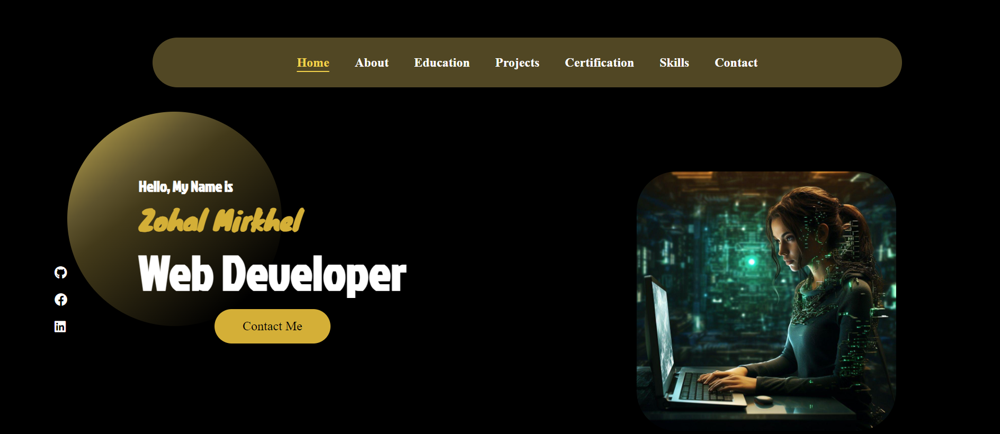

# Zohal Mirkhel's Portfolio

This portfolio showcases the projects and skills of me (Zohal Mirkhel), a web developer specializing in HTML, CSS, JavaScript, Java, SQL, WordPress, and Bootstrap. The portfolio is designed with a modern, minimalist aesthetic and features a dark theme.

# Zohal Mirkhel's Portfolio

This portfolio showcases the projects and skills of Zohal Mirkhel, a web developer specializing in HTML, CSS, JavaScript, Java, SQL, WordPress, and Bootstrap. The portfolio is designed with a modern, minimalist aesthetic and features a dark theme.

## Table of Contents

- [Introduction](#introduction)
- [Features](#features)
- [Technologies Used](#technologies-used)
- [Installation](#installation)
- [Usage](#usage)
- [Contact](#contact)
- [License](#license)

## Introduction

Welcome to my portfolio! This website highlights my journey as a web developer, showcasing my skills, projects, and professional experience. It is designed to provide a comprehensive view of my capabilities and accomplishments.

## Features

- **Responsive Design**: The portfolio is fully responsive and adapts to different screen sizes and devices.
- **Navigation Bar**: Includes links to Home, About, Work, and Contact sections.
- **Contact Information**: Includes email, phone number, address, and working hours.
- **Project Showcase**: Highlights various projects with descriptions and links to live sites and repositories.
- **Skills and Experience**: Details my professional background and technical skills.
- **Contact Form**: Allows visitors to contact me directly through the website.


## Technologies Used

- **HTML**: Structure and content of the web pages.
- **CSS**: Styling and layout of the web pages, including a dark theme and responsive design.
- **JavaScript**: Interactive elements and form validation.
- **FontAwesome**: Icons used throughout the site.
- **EmailJS**: For contact form integration.


## Live Demo


You can view a live demo of the project [here](https://zohalmirkhel.github.io/Telephone-Number-Validator/)


## Installation

To set up this project locally, follow these steps:


1. **Clone the repository**:
   ```bash
   git clone git@github.com:ZohalMirkhel/Personal_Portfolio.git
   ```
2. **Navigate to the project directory**:
   ```bash
   cd portfolio
   ```

3. **Open the `index.html` file in your browser**:
   ```bash
   open index.html
   ```

4. **View the source code:**
If you want to explore the source code, open the project in your preferred code editor (e.g., VSCode):
   ```bash
   code .
   ```


## Technologies Used

* HTML
* CSS
* JavaScript
* EmailJS

Note: No additional installations or dependencies are required for the JavaScript to work properly. The code runs directly in the browser.

## Contribution
1. **Hadisa Zahirzai**.
2. **Zabeena Sherzoie**.
3. **Safia Iqbal**.

## Contributing

We welcome contributions to improve the Roman Number Converter. If you have ideas for enhancements, notice any issues, or want to work on this project, please follow these steps:

1. **Fork the repository**.
2. **Create a new branch:** `git checkout -b feature-name`
3. **Make your changes and commit them:** `git commit -m "Description of changes"`
4. **Push to the branch:** `git push origin feature-name`
5. **Create a pull request**


## Troubleshooting

If you encounter any issues with the application, please refer to the following:

* Check that you have entered a valid Arabic number in the input field.
* Ensure that you have enabled JavaScript in your browser.
* If you are still experiencing issues, feel free to open an issue on this repository or contact me directly.

## Author

For any questions, feedback, or support, please contact me at:
- Email: [zohalmirkhel@gmail.com](mailto:zohalmirkhel@gmail.com)
- GitHub: [Zohal Mirkhel](https://github.com/ZohalMirkhel)
- LinkedIn: [Zohal Mirkhel](https://www.linkedin.com/in/zohal-mirkhel-840a7530a/)